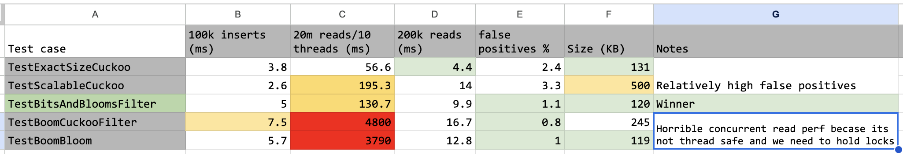

# Filters

The use case we have for a filter for lsmtree is to have a quick check that can eliminate keys
that dont have any mapping in the lsmtree. For this to work, the requirement is that, we should
have 0 false positives and minimal false negatives. In the case of an lsmtree we will have one
filter per sstable file and the sstables are immutable - So our requirement is only for a read-only
datastructure

Cuckoo filters and its predecessor bloomfilters are the right fit for this use case. Apart
from differences in performance and underlying methodology the main advantage of cuckoo filter
over bloom filter is that cuckoo filters support removing entries from the datastructure. Given
that our requirement is only for reads, this does not matter to us.

This module adds a thin layer of abstraction over popular cuckoo/bloom filter implementations
in golang, so that we have the ability to swap out various implementations depending on use case
and performance.

## Cuckoo filter

Cuckoo filters have 2 implementations

* fixed size: If we insert more entries, the filter gets saturated and stops accepting new insertions
* dynamic/scalable: It detects saturation and scales up the internal datastructure

## Results

Libraries tested

* github.com/seiflotfy/cuckoofilter:
    * Fixed size: See TestExactSizeCuckoo
    * Scalable : See TestScalableCuckoo
* github.com/tylertreat/BoomFilters
    * TestBoomCuckooFilter
    * TestBoomBloom
* github.com/bits-and-blooms/bloom/v3
    * TestBitsAndBloomsFilter

Comparison

We picked github.com/bits-and-blooms/bloom/v3 as it has the most sensible
performance for read heavy loads

BoomFilters is generally good, but the library uses hash.Hash64 hash functions that are not thread safe.
Out of the box, it has the best false positive rate for the simple benchmark I wrote.



Test dump

```
=== RUN   TestExactSizeCuckoo
    filter_test.go:33: Took 3.803875ms to insert 100000 entries
    filter_test.go:94: Took 56.647541ms to read 20000000 entries with a parallelism of 10
    filter_test.go:94: Took 4.412333ms to read 200000 entries with a parallelism of 1
    filter_test.go:54: numPassingNonInserts:2.398% numPassingInserts:100% num keys:100000 Datasctucture Size:131072
--- PASS: TestExactSizeCuckoo (0.16s)
=== RUN   TestScalableCuckoo
    filter_test.go:33: Took 2.550083ms to insert 100000 entries
    filter_test.go:94: Took 195.326166ms to read 20000000 entries with a parallelism of 10
    filter_test.go:94: Took 14.023667ms to read 200000 entries with a parallelism of 1
    filter_test.go:54: numPassingNonInserts:3.29% numPassingInserts:100% num keys:100000 Datasctucture Size:508008
--- PASS: TestScalableCuckoo (0.31s)
=== RUN   TestBitsAndBloomsFilter
    filter_test.go:33: Took 5.077708ms to insert 100000 entries
    filter_test.go:94: Took 130.694417ms to read 20000000 entries with a parallelism of 10
    filter_test.go:94: Took 9.903875ms to read 200000 entries with a parallelism of 1
    filter_test.go:54: numPassingNonInserts:1.076% numPassingInserts:100% num keys:100000 Datasctucture Size:119840
--- PASS: TestBitsAndBloomsFilter (0.23s)
=== RUN   TestBoomCuckooFilter
    filter_test.go:33: Took 7.480166ms to insert 100000 entries
    filter_test.go:94: Took 4.76695425s to read 20000000 entries with a parallelism of 10
    filter_test.go:94: Took 16.734083ms to read 200000 entries with a parallelism of 1
    filter_test.go:54: numPassingNonInserts:0.797% numPassingInserts:100% num keys:100000 Datasctucture Size:245835
--- PASS: TestBoomCuckooFilter (4.89s)
=== RUN   TestBoomBloom
    filter_test.go:33: Took 5.726708ms to insert 100000 entries
    filter_test.go:94: Took 3.79014s to read 20000000 entries with a parallelism of 10
    filter_test.go:94: Took 12.8365ms to read 200000 entries with a parallelism of 1
    filter_test.go:54: numPassingNonInserts:0.996% numPassingInserts:100% num keys:100000 Datasctucture Size:119856
--- PASS: TestBoomBloom (3.90s)
```
